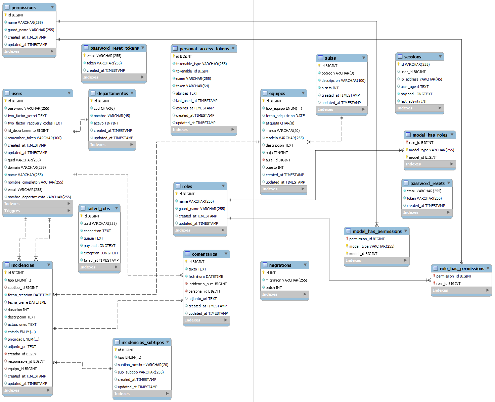
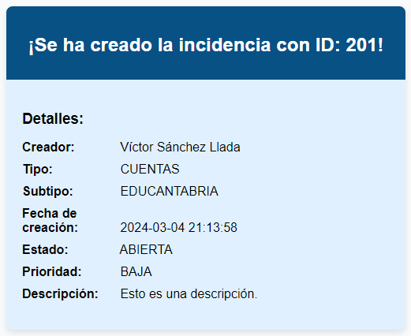
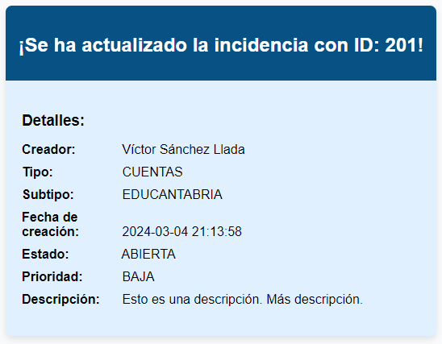
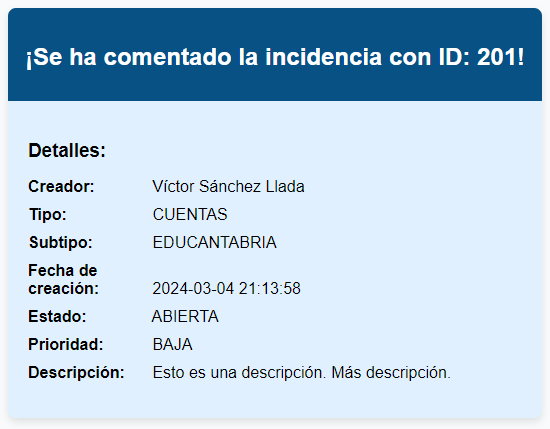

# Documentación del proyecto

## Índice

- [Documentación del proyecto](#documentación-del-proyecto)
  - [Índice](#índice)
  - [Introducción](#introducción)
  - [Base de datos](#base-de-datos)
    - [Eventos](#eventos)
    - [Triggers](#triggers)
  - [PHP](#php)
    - [.ENV](#env)
    - [Librerías](#librerías)
      - [Jetstream (laravel/jetstream)](#jetstream-laraveljetstream)
      - [LDAPRecord (directorytree/ldaprecord-laravel)](#ldaprecord-directorytreeldaprecord-laravel)
      - [Laravel Excel (maatwebsite/excel)](#laravel-excel-maatwebsiteexcel)
      - [DOMPDF (dompdf/dompdf)](#dompdf-dompdfdompdf)
    - [Traducciones](#traducciones)
    - [Zona horaria](#zona-horaria)
    - [Envío de correos electrónicos](#envío-de-correos-electrónicos)
      - [Tipos de correos electrónicos (avisos)](#tipos-de-correos-electrónicos-avisos)
        - [Cuando se crea una incidencia](#cuando-se-crea-una-incidencia)
        - [Cuando se actualiza una incidencia](#cuando-se-actualiza-una-incidencia)
        - [Cuando se comenta una incidencia](#cuando-se-comenta-una-incidencia)
  - [JavaScript](#javascript)
    - [Subsección 2.1](#subsección-21)
    - [Subsección 2.2](#subsección-22)
  - [Bootstrap y CSS](#bootstrap-y-css)
    - [Paleta de colores](#paleta-de-colores)
    - [Diseño](#diseño)
    - [Uso de Bootstrap](#uso-de-bootstrap)
      - [Componentes de Bootstrap usados:](#componentes-de-bootstrap-usados)
        - [Alerts (Alertas)](#alerts-alertas)
        - [Breadcrumb (Migas de pan)](#breadcrumb-migas-de-pan)
        - [Buttons (Botones) y Dropdowns (Botones desplegables)](#buttons-botones-y-dropdowns-botones-desplegables)
        - [Cards (Tarjetas)](#cards-tarjetas)
        - [Navbar (Barra de navegación)](#navbar-barra-de-navegación)
        - [Modals (Modales)](#modals-modales)
        - [Offcanvas (Barra lateral desplegable)](#offcanvas-barra-lateral-desplegable)
        - [Close button (Botones de cerrado)](#close-button-botones-de-cerrado)
        - [Pagination (Paginación)](#pagination-paginación)
    - [Implementación de clases reutilizables](#implementación-de-clases-reutilizables)
  - [Despliegue de la aplicación](#despliegue-de-la-aplicación)
    - [Instalación de Apache2](#instalación-de-apache2)
    - [Instalación de MySQL](#instalación-de-mysql)
    - [Instalación de PHP 8 y librerías](#instalación-de-php-8-y-librerías)
      - [Configuración de PHP](#configuración-de-php)
    - [Habilitar PHP sobre Apache2](#habilitar-php-sobre-apache2)
    - [Instalar phpMyAdmin](#instalar-phpmyadmin)
    - [Instalar Composer](#instalar-composer)
    - [Instalar NodeJS](#instalar-nodejs)
      - [Desinstalar versión pre-instalada](#desinstalar-versión-pre-instalada)
      - [Instalar versión 20.x](#instalar-versión-20x)
    - [Instalar Webmin](#instalar-webmin)
    - [Instalar extensión LDAP](#instalar-extensión-ldap)
    - [Certificado y HTTPS](#certificado-y-https)
      - [Crear certificado autofirmado](#crear-certificado-autofirmado)
      - [Configurar Apache para usar SSL](#configurar-apache-para-usar-ssl)
        - [Habilitar módulo SSL](#habilitar-módulo-ssl)
    - [Crear sitio web](#crear-sitio-web)
    - [Script de despliegue](#script-de-despliegue)
  - [Documentación de código](#documentación-de-código)
    - [Generación de documentación](#generación-de-documentación)
  - [Implementaciones faltantes](#implementaciones-faltantes)
  - [Mejoras o posibles cambios a futuro](#mejoras-o-posibles-cambios-a-futuro)
  - [Problemas encontrados](#problemas-encontrados)
  - [Bibliografía y Webgrafía](#bibliografía-y-webgrafía)
    - [Bibliografía](#bibliografía)
    - [Webgrafía](#webgrafía)

## Introducción

Documento que detalla lo realizado en el proyecto.

## Base de datos

Tendremos una base de datos llamada 'incidencias_tic' con cotejamiento 'utf8mb4_unicode_ci'.

Almacenará los datos necesarios para gestionar las incidencias TIC que pueden surgir en un instituto. Además de disponer de tablas de roles y permisos para los usuarios de la aplicación.

Todo lo relacionado con base de datos estará creado mediante PHP con migraciones para las tablas y factories y seeders para la inserción de datos. El diagrama de la base de datos de incidencias es el siguiente:



### Eventos

Activaremos los eventos en la base de datos para crear un trabajo que establecerá en estado 'cerrado' las incidencias que pasen más de un día en estado 'resuelto'. Este evento se ejecutará todos los días a las 23:59h llamando al procedimiento almacenado correspondiente.

```sql
SET GLOBAL event_scheduler = 1;
```

```sql
CREATE PROCEDURE IF NOT EXISTS cerrarIncidenciasResueltas()
BEGIN
    UPDATE incidencias
    SET estado = "cerrada", fecha_cierre = NOW()
    WHERE estado = "resuelta" AND fecha_cierre IS NOT NULL AND fecha_cierre < NOW() - INTERVAL 1 DAY;
END;
```

```sql
CREATE EVENT IF NOT EXISTS cerrarIncidenciasEvent
ON SCHEDULE EVERY 1 DAY
STARTS CURRENT_DATE + INTERVAL 23 HOUR + INTERVAL 59 MINUTE
ON COMPLETION PRESERVE
DO CALL cerrarIncidenciasResueltas();
```

### Triggers

Crearemos dos triggers en la base de datos.

El primero se ejecutará antes de la inserción de un registro en la tabla 'users' y consistirá en comprobar si el departamento que tiene, si es que tiene, existe en la tabla 'departamentos' para así recoger el id del departamento y grabarle junto al registro en la tabla 'users'.

```sql
CREATE TRIGGER before_insert_user
BEFORE INSERT ON users FOR EACH ROW
BEGIN
    -- Almacenar temporalmente el ID del departamento encontrado
    DECLARE departamento_id bigint(20);

    -- Verificar si el campo nombre_departamento no es NULL
    IF NEW.nombre_departamento IS NOT NULL THEN
        -- Buscar el departamento en la tabla departamentos
        SELECT id INTO departamento_id FROM departamentos WHERE nombre = NEW.nombre_departamento;

        -- Si se encuentra el departamento, actualizar id_departamento en users
        IF departamento_id IS NOT NULL THEN
            SET NEW.id_departamento = departamento_id;
        END IF;
    END IF;
END;
```

El segundo se ejecutará después de la inserción de un registro en la tabla 'users' y consistirá en establacer su rol. Si es el primer registro que se inserta en la tabla, su rol será 'administrador' de lo contrario será 'profesor'.

```sql
CREATE TRIGGER IF NOT EXISTS asignar_rol_after_insert_user
AFTER INSERT ON users FOR EACH ROW
BEGIN
    -- Variables
    DECLARE usuarios_totales INT; -- Cantidad de usuarios en la tabla users. Nos indicará si es el primer login o no.
    DECLARE administrador_role_id INT; -- ID del rol administrador en la tabla roles
    DECLARE usuario_role_id INT; -- ID del rol usuario en la tabla roles
    DECLARE user_model_type VARCHAR(255); -- Espacio de nombres que será el tipo del modelo en la tabla model_has_roles

    -- Guardar el namespace del modelo de usuario
    SET user_model_type = "App\\\\Models\\\\User";

    -- Obtener el número total de usuarios
    SELECT COUNT(*) INTO usuarios_totales FROM users;

    -- Obtener los IDs de los roles por su nombre
    SELECT id INTO administrador_role_id FROM roles WHERE name = "administrador";
    SELECT id INTO usuario_role_id FROM roles WHERE name = "profesor";

    -- Asignar el rol según si es el primer login o no
    IF usuarios_totales = 1 THEN
        INSERT INTO model_has_roles (role_id, model_type, model_id) VALUES (administrador_role_id, user_model_type, NEW.id);
    ELSE
        INSERT INTO model_has_roles (role_id, model_type, model_id) VALUES (usuario_role_id, user_model_type, NEW.id);
    END IF;
END;
```

## PHP

Para el apartado del backend hemos utilizado el lenguaje PHP 8.2.4 junto al framework Laravel 10.

### .ENV

En el archivo .env tendremos configuraciones de la aplicación como:

* Nombre de la aplicación.
* Parámetros de conexión a base de datos.
* Parámetros de configuración de envío de correo electrónico.
* Parámetros de conexión al LDAP, así como las unidades organizativas a las que pertenecen los usuarios que pueden autenticarse en la aplicación.

### Librerías

Para darle ciertas funcionalidades extras, más allá de las que proporciona el propio framework Laravel, hemos utilizado varias librerías.

#### Jetstream (laravel/jetstream)

Utilizada para la autenticación de los usuarios en la aplicación.

#### LDAPRecord (directorytree/ldaprecord-laravel)

Utilizada para validar las credenciales contra el LDAP. Además se han implementado reglas de acceso para permitir el login a aquellos usuarios del LDAP que pertenezcan a unidades organizativas específicas.

#### Laravel Excel (maatwebsite/excel)

Utilizada para la realización de reports en formatos xlsx y csv. Se han creado clases y vistas según el contenido de datos a exportar y métodos genéricos para generar los reports en los formatos pdf, xlsx o csv.

#### DOMPDF (dompdf/dompdf)

Utilizada, a través de Laravel Excel, para la realización de reports en formato pdf.

### Traducciones

Se han instalado las traducciones a español y configurado la aplicación en consecuencia.

### Zona horaria

Hemos configurado la aplicación para utilizar la zona horaria 'Europe/Madrid'.

### Envío de correos electrónicos

Para el envío de correos electrónicos en la aplicación se ha creado una clase que construye los datos del correo junto a una vista.

#### Tipos de correos electrónicos (avisos)

##### Cuando se crea una incidencia



##### Cuando se actualiza una incidencia



##### Cuando se comenta una incidencia



## JavaScript

Para el apartado del frontend hemos utilizado el lenguaje JavaScript sin ningún framework.

### Subsección 2.1

Contenido de la subsección 2.1.

### Subsección 2.2

Contenido de la subsección 2.2.

## Bootstrap y CSS

Hemos usado Bootstrap un framework CSS, ademas de CSS tradicional.

### Paleta de colores

Optamos por la siguiente paleta de colores, en tonos azules utilizados en toda la interfaz de la aplicación, además de colores blancos y negros y un color morado usado en la vista del login y las vista de error 403 y 403.

| Nombre del Color | Código Hexadecimal | Muestra |
| ---------------- | ------------------ | ------- |
| Aquamarine 50    | #f0f8ff            | <div style="width: 20px; height: 20px; background-color: #f0f8ff;"></div> |
| Aquamarine 100   | #e0f0fe            | <div style="width: 20px; height: 20px; background-color: #e0f0fe;"></div> |
| Aquamarine 200   | #bae2fd            | <div style="width: 20px; height: 20px; background-color: #bae2fd;"></div> |
| Aquamarine 300   | #60bffb            | <div style="width: 20px; height: 20px; background-color: #60bffb;"></div> |
| Aquamarine 400   | #38b1f8            | <div style="width: 20px; height: 20px; background-color: #38b1f8;"></div> |
| Aquamarine 500   | #0e97e9            | <div style="width: 20px; height: 20px; background-color: #0e97e9;"></div> |
| Aquamarine 600   | #0277c7            | <div style="width: 20px; height: 20px; background-color: #0277c7;"></div> |
| Aquamarine 700   | #035fa1            | <div style="width: 20px; height: 20px; background-color: #035fa1;"></div> |
| Aquamarine 800   | #075185            | <div style="width: 20px; height: 20px; background-color: #075185;"></div> |
| Aquamarine 900   | #0c446e            | <div style="width: 20px; height: 20px; background-color: #0c446e;"></div> |
| Aquamarine 950   | #082b49            | <div style="width: 20px; height: 20px; background-color: #082b49;"></div> |
| Blanco 50        | #ffffff            | <div style="width: 20px; height: 20px; background-color: #ffffff;"></div> |
| Blanco 100       | #f8fafc            | <div style="width: 20px; height: 20px; background-color: #f8fafc;"></div> |
| Morado 50        | #b444f5            | <div style="width: 20px; height: 20px; background-color: #b444f5;"></div> |
| Negro 50         | #000000            | <div style="width: 20px; height: 20px; background-color: #000000;"></div> |

### Diseño

Para tener una estética limpia, se ha optado por un CRUD con el menú principal en la parte superior de la pantalla un pie de página con las mismas opciones de navegación, el objetivo era centrar la información más importante para que la experiencia de usuario simple y amigable, las funcionalidades más especificas como filtrado, informes y chat de comentarios, las hemos colocado en las barras desplegables (offcanvas), además con el uso de modales nos aseguramos de que el usuario realice las acciones de manera segura, aplicamos el color rojo para llamar la atención del usuario a la hora de realizar cambios importantes como borrado o actualizado de datos.

### Uso de Bootstrap

Hemos usado Bootstap lo máximo posible, aplicando componentes predefinidos y aplicando estilos para que concuerde con el diseño que hemos efectuado.

#### Componentes de Bootstrap usados:

* Alerts (Alertas)
* Breadcrumb (Migas de pan)
* Buttons (Botones)
* Cards (Tarjetas)
* Close button (Botones de cerrado)
* Dropdowns (Botones desplegables)
* Modals (Modales)
* Navbar (Barra de navegación)
* Offcanvas (Barra lateral desplegable)
* Pagination (Paginación)

##### Alerts (Alertas)
Las alertas son usadas cuando hay errores o para informar al usuario de acciones que se han realizado.

##### Breadcrumb (Migas de pan)
También llamadas migas de pan son usadas para informar al usuario en qué parte de la aplicación está situado, además puede usar lo puede usar para navegar por las distintas secciones.

##### Buttons (Botones) y Dropdowns (Botones desplegables)
Son usados para realizar acciones y/o confirmar cambios, además los botones desplegables contienen diferentes acciones.

##### Cards (Tarjetas)
Están presentes en toda la información de las incidencias, usuarios y el chat de comentarios.

##### Navbar (Barra de navegación)
Usado en la cabecera de la página, contiene el logo con los distintos enlaces a las distintas páginas.

##### Modals (Modales)
Proporciona información al usuario antes de realizar acciones críticas, como borrado y actualización de incidencias y usuarios.

##### Offcanvas (Barra lateral desplegable)
Usados par contener los filtros de incidencias y usuarios, los informes, y el chat de comentarios de cada incidencia.

##### Close button (Botones de cerrado)
Sirven para cerrar los modales o las barras laterales desplegables.

##### Pagination (Paginación)
Para navegar en la tabla de incidencias y usuarios.

### Implementación de clases reutilizables

Adoptando la idea y filosofía de Bootstrap y de frameworks como Tailwind, hemos implementado clases CSS genéricas que sirven para cambiar los colores de fondo de los elementos y botones, de esta manera la podemos crear componentes reutilizables fácilmente y que la estética de la aplicación sea homogénea.

## Despliegue de la aplicación

La aplicación se desplegará en un servidor linux con Ubuntu 22.04.4 LTS.

### Instalación de Apache2

```shell
$ apt-get install apache2
```

### Instalación de MySQL

```shell
$ apt-get install mysql-serve
```

### Instalación de PHP 8 y librerías

```shell
$ add-apt-repository ppa:ondrej/php
```

```shell
$ apt-get update
```

```shell
$ apt install php8.2 libapache2-mod-php8.2 php8.2-curl php8.2-intl php8.2-zip
php8.2-soap php8.2-xml php8.2-gd php8.2-mbstring php8.2-bcmath php8.2-common
php8.2-xml php8.2-mysqli
```

#### Configuración de PHP

```ini
memory_limit=2048M
max_execution_time=240
extension=zip
extension=gd
```

### Habilitar PHP sobre Apache2

```shell
$ a2enmod php8.2
```

```shell
$ a2enmod rewrite
```

```shell
$ systemctl restart apache2
```

### Instalar phpMyAdmin

Instalaremos phpMyAdmin para gestionar la base de datos.

```shell
$ apt install phpmyadmin
```

### Instalar Composer

```shell
$ apt install curl php-mbsting git unzip
```

```shell
$ curl -sS https://getcomposer.org/installer | sudo php -- --install-dir=/usr/local/bin --filename=composer
```

### Instalar NodeJS

#### Desinstalar versión pre-instalada

```shell
$ apt remove nodejs
```

```shell
$ apt-get remove libnode-dev
```

#### Instalar versión 20.x
```shell
$ curl -sL https://deb.nodesource.com/setup_20.x -o nodesource_setup.sh
```

```shell
$ bash nodesource_setup.sh
```

```shell
$ apt install nodejs
```

### Instalar Webmin

Para gestionar otros aspectos del servidor instalaremos Webmin.

```shell
$ wget -q http://www.webmin.com/jcameron-key.asc -O- | sudo apt-key add -
```

```shell
$ add-apt-repository "deb [arch=amd64] http://download.webmin.com/download/repository sarge contrib"
```

```shell
$ apt update && sudo apt install webmin -y
```

### Instalar extensión LDAP

Como en nuestra aplicación hacemos login contra LDAP tendremos que instalar la librería correspondiente y habilitarla.

```shell
$ apt-get install php8.2-ldap
```

```ini
extension=ldap
```

### Certificado y HTTPS

####  Crear certificado autofirmado

```shell
$ cd /etc/apache2/
```

```shell
$ mkdir ssl
```

```shell
$ openssl req -x509 -nodes -days 365 -newkey rsa:2048 -keyout /etc/apache2/ssl/apache-selfsigned.key -out /etc/apache2/ssl/apache-selfsigned.crt
```

#### Configurar Apache para usar SSL

##### Habilitar módulo SSL

```shell
$ a2enmod ssl
```

```shell
$ systemctl restart apache2
```

### Crear sitio web

```shell
$ mkdir /vat/www/incidencias-tic
```

```shell
$ cd /etc/apache2/sites-available
```

```shell
$ cp default-ssl.conf incidencias-tic.conf
```

```apache
<IfModule mod_ssl.c>
    <VirtualHost _default_:443>
        ServerName www.incidencias-tic.com
        ServerAlias incidencias-tic.com
        ServerAdmin webmaster@localhost
        DocumentRoot /var/www/incidencias-tic/public

        <Directory /var/www/incidencias-tic>
            AllowOverride All
        </Directory>

        ErrorLog ${APACHE_LOG_DIR}/incidencias-tic.error.log
        CustomLog ${APACHE_LOG_DIR}/incidencias-tic.access.log combined

        SSLEngine on
        SSLCertificateFile /etc/apache2/ssl/apache-selfsigned.crt
        SSLCertificateKeyFile /etc/apache2/ssl/apache-selfsigned.key

        <FilesMatch "\.(cgi|shtml|phtml|php)$">
            SSLOptions +StdEnvVars
        </FilesMatch>

        <Directory /usr/lib/cgi-bin>
            SSLOptions +StdEnvVars
        </Directory>
    </VirtualHost>
</IfModule>
```

```shell
$ a2ensite incidencias-tic.conf
```

### Script de despliegue

Utilizaremos un script para desplegar nuestra aplicación en el sitio creado.

```bash
#!/bin/bash

# Códigos de escape ANSI para colores
rojo='\033[0;31m'
verde='\033[0;32m'
azul='\033[0;34m'
reset='\033[0m'

# Imprimir por pantalla el menú
mostrar_menu() {
    echo "Selecciona una opción:"
    echo "1 - Configuración y despliegue inicial"
    echo "2 - Actualizar la aplicación"
    echo "3 - Ejecutar migraciones y seeders"
    echo "4 - Salir"
}

# Función para ejecutar migraciones y seeders
ejecutar_migraciones_y_seeders() {
    carpeta_aplicacion="$1"

    # Comprobar si se pasó por parámetro una carpeta de aplicación
    if [ -z "$carpeta_aplicacion" ]; then
        # Solicitar la carpeta de la aplicación
        read -p "Introduce la carpeta de la aplicación: " carpeta_aplicacion

        # Comprobar si la carpeta existe
        if [ ! -d "$carpeta_aplicacion" ]; then
            echo "${rojo}La carpeta de la aplicación no existe. Por favor, introduce una carpeta válida.${reset}"
            return
        fi

        # Cambiar a la carpeta de la aplicación
        echo -e "${azul}Cambiando ubicación a $carpeta_aplicacion...${reset}"
        cd "$carpeta_aplicacion" || exit
    fi

    # Ejecución de migraciones
    read -p "¿Deseas ejecutar las migraciones de la base de datos? (S/n): " ejecutar_migraciones
    if [[ $ejecutar_migraciones == "S" || $ejecutar_migraciones == "s" || $ejecutar_migraciones == "" ]]; then
        php artisan migrate:fresh

        # Preguntar si desea ejecutar los seeders
        read -p "¿Deseas ejecutar los seeders de la base de datos? (S/n): " ejecutar_seeders
        if [[ $ejecutar_seeders == "S" || $ejecutar_seeders == "s" || $ejecutar_seeders == "" ]]; then
            php artisan db:seed
        else
            echo -e "${azul}No se ejecutarán los seeders.${reset}"
        fi
    else
        echo -e "${azul}No se ejecutarán las migraciones ni los seeders.${reset}"
    fi
}

# Función para ejecutar el despliegue y configuración inicial
ejecutar_despliegue_inicial() {
    # Solicitar la carpeta de destino
    read -p "Introduce la carpeta de destino donde se clonará el repositorio: " carpeta_destino

    # Verificar si la carpeta no existe y crearla
    if [ ! -d "$carpeta_destino" ]; then
        echo -e "${azul}La carpeta de destino no existe. Creando la carpeta...${reset}"
        mkdir -p "$carpeta_destino"
    fi

    # Solicitar la URL del repositorio
    read -p "Introduce la URL del repositorio Git: " repo_url

    # Clonar el repositorio en la carpeta de destino
    echo -e "${azul}Clonar repositorio...${reset}"
    git clone "$repo_url" "$carpeta_destino"

    # Cambiar de ubicación a la carpeta de destino configurada
    echo -e "${azul}Cambiando ubicación a $carpeta_destino...${reset}"
    cd "$carpeta_destino" || exit

    # Instalación de las dependencias de PHP con Composer
    echo -e "${azul}Instalar dependencias de PHP con Composer...${reset}"
    composer install

    # Instalación de las dependencias de JS con NPM
    echo -e "${azul}Instalar dependencias de JavaScript con npm...${reset}"
    npm install

    # Copiar .env.example a .env
    echo -e "${azul}Copiar .env.example a .env...${reset}"
    cp .env.example .env

    # Paramos la ejecución hasta configurar el archivo .env correctamente
    read -p "Crea tu BD y configura el archivo .env. Luego presiona Enter para continuar."

    # Generamos la clave de la app en el .env
    echo -e "${azul}Generar la clave de la aplicación...OK!${reset}"
    php artisan key:generate

    # Ejecución de migraciones y seeders
    ejecutar_migraciones_y_seeders "$carpeta_destino"

    # Compilar assets con NPM build
    echo -e "${azul}Compilar assets con npm...${reset}"
    npm run build

    # Aplicar permisos necesarios a la carpeta de destino
    echo -e "${azul}Aplicar permisos a la carpeta del sitio...${reset}"
    chown -R www-data:www-data "$carpeta_destino"
    chmod -R 755 "$carpeta_destino"
    # Error: The stream or file "/var/www/****/storage/logs/laravel.log" could not be opened in append mode: Failed to open stream: Permission denied
    chown -R www-data:www-data "$carpeta_destino/storage"
    chmod -R 775 "$carpeta_destino/storage"

    # Fin script
    echo -e "${verde}¡Instalación y configuración completadas!${reset}"
}

# Función para ejecutar la actualización sobre el repositorio clonado
ejecutar_actualizacion() {
    # Solicitar la carpeta de la aplicación
    read -p "Introduce la carpeta de la aplicación a actualizar: " carpeta_actualizacion

    # Comprobar si la carpeta existe
    if [ ! -d "$carpeta_actualizacion" ]; then
        echo -e "${rojo}La carpeta de la aplicación no existe. Por favor, introduce una carpeta válida.${reset}"
        return
    fi

    # Cambiar a la carpeta de la aplicación
    echo -e "${azul}Cambiando ubicación a $carpeta_actualizacion...${reset}"
    cd "$carpeta_actualizacion" || exit

    echo -e "${azul}Actualizar la aplicación en la carpeta $carpeta_actualizacion...${reset}"
    git fetch origin
    git reset --hard origin/main
    echo -e "${verde}¡Actualización completada!${reset}"

    # Ejecutar migraciones y seeders
    ejecutar_migraciones_y_seeders "$carpeta_actualizacion"
}

# Menú principal
while true; do
    mostrar_menu

    read -p "Introduce el número de la opción: " opcion

    case $opcion in
        1)
            ejecutar_despliegue_inicial
            ;;
        2)
            ejecutar_actualizacion
            ;;
        3)
            ejecutar_migraciones_y_seeders
            ;;
        4)
            echo -e "${verde}Saliendo del script. ¡Hasta luego!${reset}"
            exit 0
            ;;
        *)
            echo -e "${rojo}Opción inválida. Por favor, elija una opción válida.${reset}"
            ;;
    esac
done
```

Aplicar permisos de ejecución al script creado:

```shell
$ chmod +x despliegueApp.sh
```

## Documentación de código

Para la documentación del código, clases, atributos o métodos, se han utilizado los estándares correspondientes a cada lenguaje.

### Generación de documentación

Se han generado páginas HTML estáticas con la documentación del código PHP y JS.

Para la generación de la documentación de PHP se ha utilizado la herramienta 'phpDocumentor' y para JS se ha utilizado 'JSDoc'.

## Implementaciones faltantes

* CRUD de algunas tablas maestras como:
  * Aulas
  * Departamentos
  * Equipos
  * Subtipos (Incidencias)

## Mejoras o posibles cambios a futuro

* Sincronización de atributos LDAP del usuario ya existentes.
* Generación de reports por los filtros de búsqueda aplicados.

## Problemas encontrados

* En la red del instituto no ha sido posible utilizar Mailtrap para enviar los correos electrónicos.

## Bibliografía y Webgrafía

### Bibliografía

Se han utilizado los apuntos aportados durante el curso por los profesores y los que hemos ido generando nosotros mismos en base a los visto durante el curso.

### Webgrafía

* [Manual MySQL](https://dev.mysql.com/doc/refman/8.0/en/)
* [Manual PHP](https://www.php.net/manual/es/index.php)
* [Documentación Laravel 10](https://laravel.com/docs/10.x)
* [LDAPRecord](https://ldaprecord.com/docs/laravel/v3)
* [Laravel Excel](https://docs.laravel-excel.com/3.1/getting-started/)
* [DOMPDF](https://github.com/dompdf/dompdf)
* [Apache2](https://httpd.apache.org/docs/current/)
* [phpMyAdmin](https://docs.phpmyadmin.net/es/latest/)
* [Composer](https://getcomposer.org/)
* [NodeJS](https://nodejs.org/en)
* [Webmin](https://webmin.com/docs/)
* [phpDocumentor](https://docs.phpdoc.org/3.0/)
* [JSDoc](https://jsdoc.app/)
* [Mailtrap](https://mailtrap.io/)
* [ChatGPT](https://chat.openai.com/auth/login)
* [Gemini](https://gemini.google.com/?hl=es)
* [Stack Overflow](https://stackoverflow.com/)
* [YouTube](https://www.youtube.com/)
